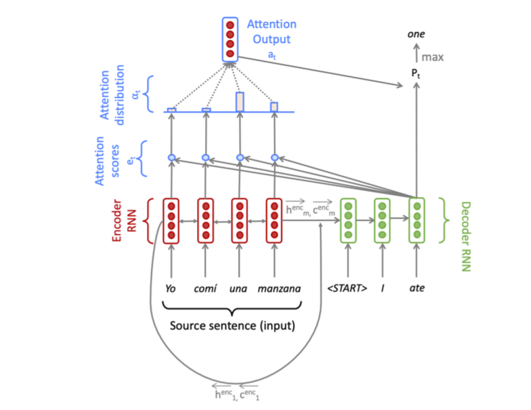

# Neural-Machine-Translation-RNN
Here, we implement a sequence-to-sequence (Seq2Seq) network with Multiplicative attention, to build a Neural Machine Translation (NMT) to convert a sentence from source language (Spanish) to target language (English). The NMT system is depicted in the below figure 

NMT system highlights
	- Encoder: Bidirectional LSTM Encoder to encode the source language (2h hidden states and 2h cell states)
	- Decoder: Unidirectional LSTM Decoder to decode the target language (h hidden states and h cell states)
	- Multiplicative attention is used (since the number of states in the encoder and decoder are not equal)
	- The attention vector (a_t) is combined with the decoder hidden state (h_t_dec) to get the combined output vector o_t -- which is used to predict the t-th target word
	- The combined output vector, o_t is also concatenated with the next time step decoder embedded vector y_t+1 before feeding into the Decoder LSTM. Hence input size for the Decoder LSTM = e+h = embed_size + hidden_size
	- Beam search is used for decoding wherein 5 most probable hypothesis is saved at each time step of the decoder

To train/run the code
	- sh run.sh vocab 
		Generates the necessary vocab file
	- sh run.sh train
		Runs the trainer and generates the NMT model 
	- sh run.sh test
		Runs 
